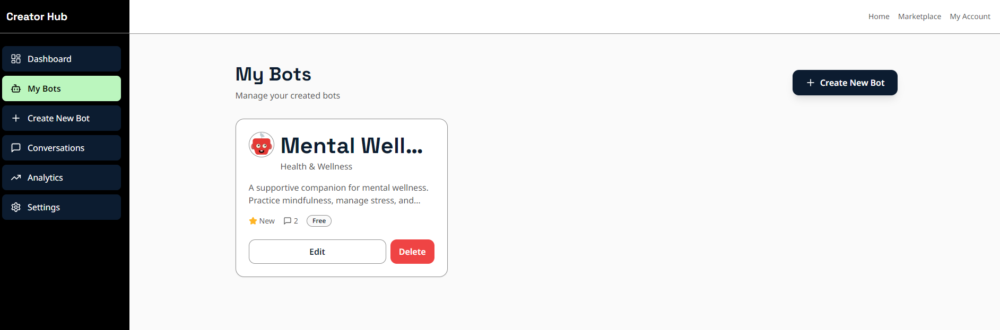
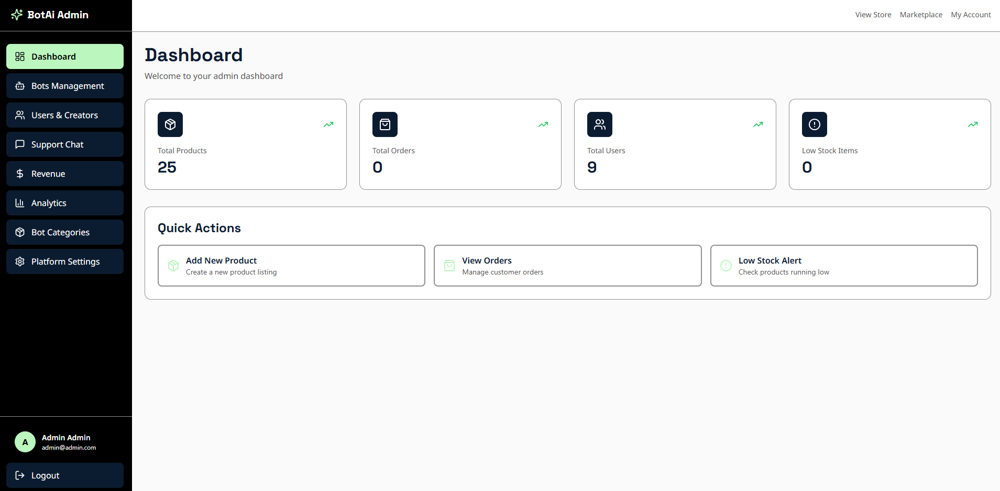
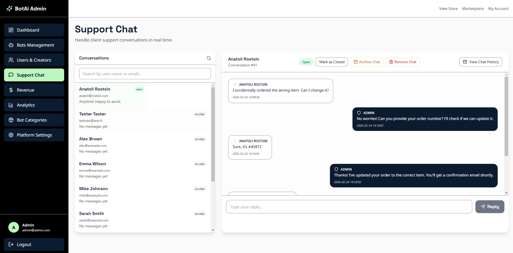
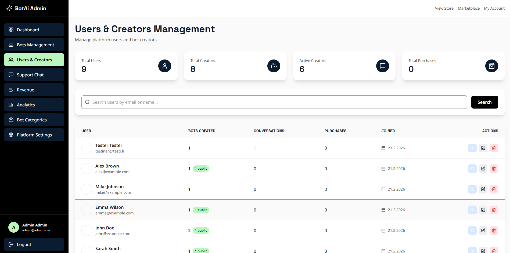
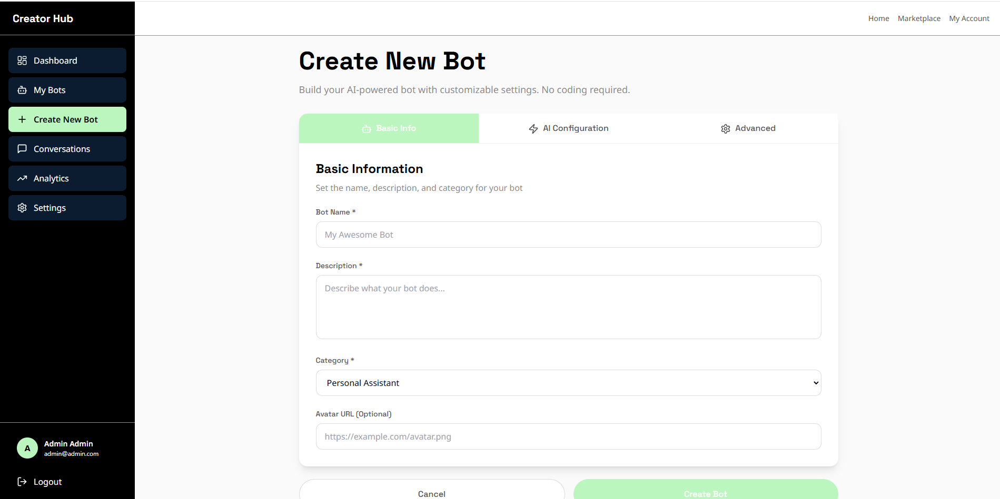
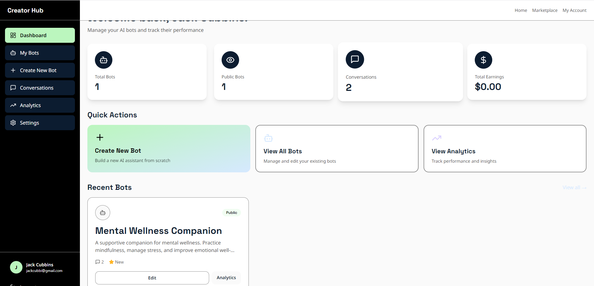
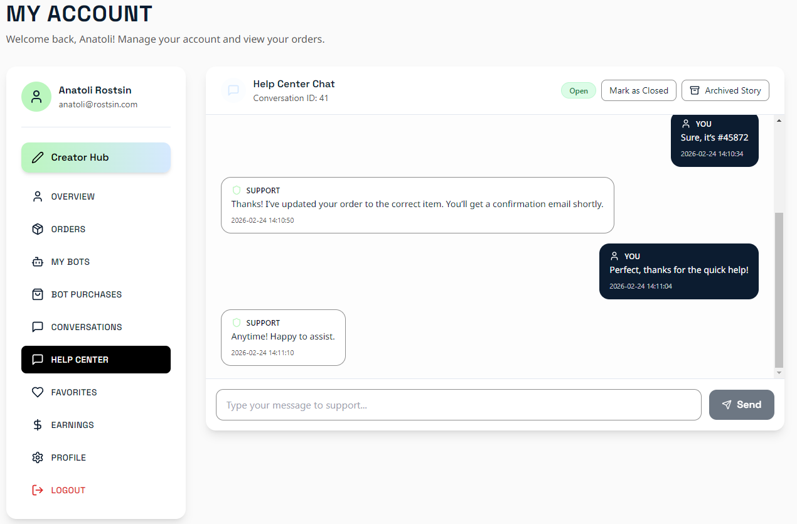
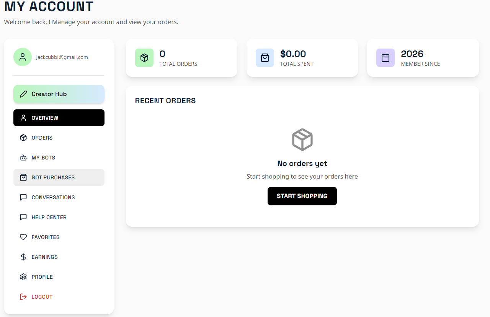
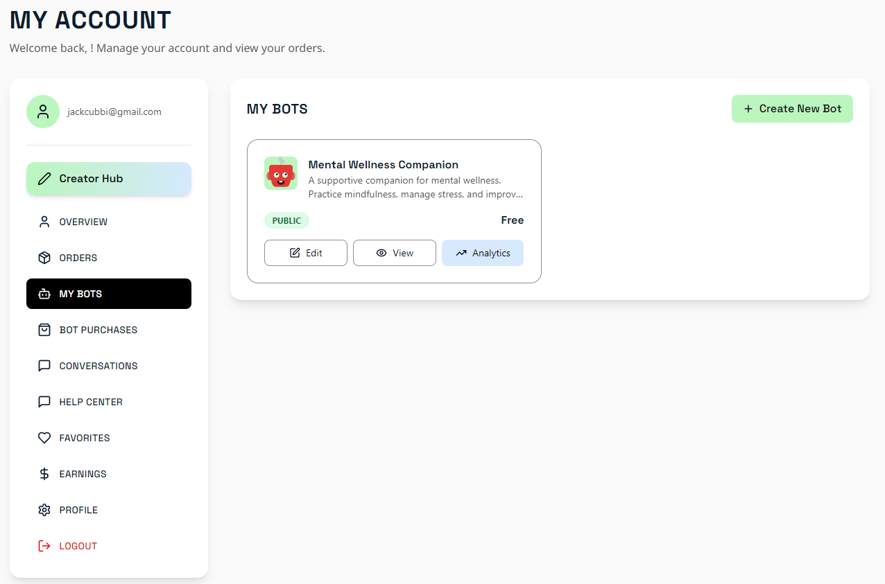
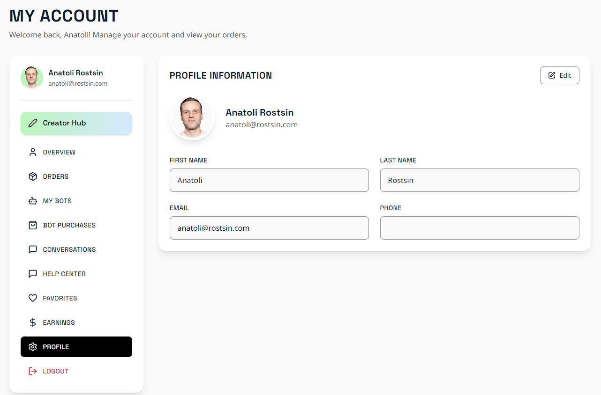

# -BotAi- - Modern E-Commerce + AI Bot Platform

Full-stack project with:

- Frontend: React + TypeScript + Vite + Tailwind
- Backend: FastAPI + SQLite + JWT auth
- Features: e-commerce, AI bots, creator/admin tools, support chat with history

## Project Structure

```
-BotAi-/
├── frontend/
│   ├── components/
│   ├── contexts/
│   ├── hooks/
│   ├── lib/
│   ├── pages/
│   ├── public/
│   ├── App.tsx
│   ├── global.css
│   ├── package.json
│   └── vite.config.ts
├── backend/
│   ├── routes/
│   ├── middleware/
│   ├── data/
│   ├── config.py
│   ├── database.py
│   ├── main.py
│   ├── models.py
│   ├── schemas.py
│   ├── requirements.txt
│   ├── .env
│   └── .env.example
└── README.md
```

## Requirements

- Node.js 18+
- Python 3.11+

## Installation

```bash
# Frontend dependencies
cd frontend
npm install --legacy-peer-deps

# Backend dependencies
cd ../backend
pip install -r requirements.txt

# Backend env
copy .env.example .env
```

## Development

Recommended (2 terminals):

```bash
# Terminal 1 (backend)
cd backend
python main.py

# Terminal 2 (frontend)
cd frontend
npm run dev:frontend
```

Default local URLs:

- Frontend: http://localhost:5173
- Backend API: http://localhost:8081
- API docs: http://localhost:8081/docs

## NPM Scripts (frontend/package.json)

```bash
npm run dev             # concurrently runs dev:backend + dev:frontend
npm run dev:frontend    # Vite dev server
npm run dev:backend     # Uvicorn backend (script currently uses port 8080)
npm run build
npm run typecheck
npm run test
npm run seed
```

## Configuration

Backend uses `backend/.env`.

Example:

```env
PORT=8081
JWT_SECRET=change-this
JWT_EXPIRATION_MINUTES=10080
DATABASE_PATH=data/yourdatabase.db
ALLOWED_ORIGINS=http://localhost:5173,http://localhost:8081,http://127.0.0.1:5173,http://127.0.0.1:8081
```

Frontend proxy is configured in `frontend/vite.config.ts` and currently points `/api` to `http://localhost:8081`.

## Recent Updates

- Support chat improvements:
  - archive/continue lifecycle
  - unread/read markers for user/admin
  - per-user unread badges in admin chat list
- Profile sync fix:
  - user profile edits now persist to backend
  - admin support chat now reads current user name/email
- Performance optimization:
  - added DB indexes for support/order/bot query paths
  - parallelized heavy account-page API calls
  - reduced support chat polling churn

## Tech Stack

Frontend:

- React 18
- TypeScript
- Vite
- TailwindCSS
- React Router

Backend:

- FastAPI
- Uvicorn
- SQLite
- Pydantic
- JWT
- SlowAPI

## License

This project does not have a specified license. Please contact the author for more details.

## Screenshots













## Author

**Anatoli Rostsin**

- GitHub: [@Jackcubbi](https://github.com/Jackcubbi)
